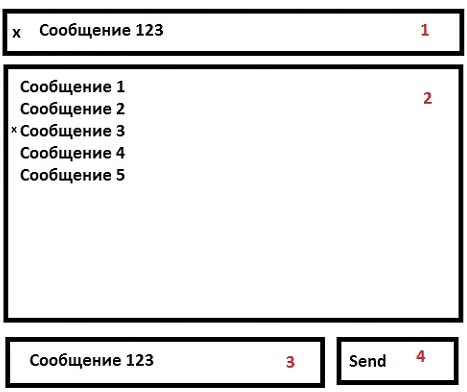

# Тех задание - список сообщений

### Задание:

Нужно выводить текстовые сообщения в блок на странице (общий вид приведён далее).

- В блоке 1 по очереди показываются все сообщения из списка с интервалом в несколько секунд. Показываться они могут несколько раз, но если пользователь нажал «х» слева в блоке 1, то это сообщение больше не будет показываться.
- Блок 2 отображает полный список сообщений, удалённые сообщения помечены знаком «х», новые сообщения добавляются в конец списка. У каждого сообщения выводится дата/время его создания.
- Блок 3 и 4 для отправки сообщений и включения в очередь для показа.

> Сверстать требуется согласно макету из Figma.
> Базовая реализация должна быть на Vue.js.
> Дополнительно разрешено использовать CSS-фреймворки (предпочтительно Bootstrap).
> Желательно, чтобы html был максимально чист (минимум вёрстки, скриптов в html).
> Кроссбраузерная вёрстка, в т.ч. для мобильных устройств.
> Готовое задание необходимо разместить на Github.

